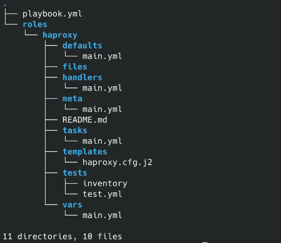
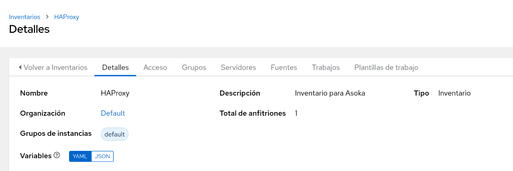
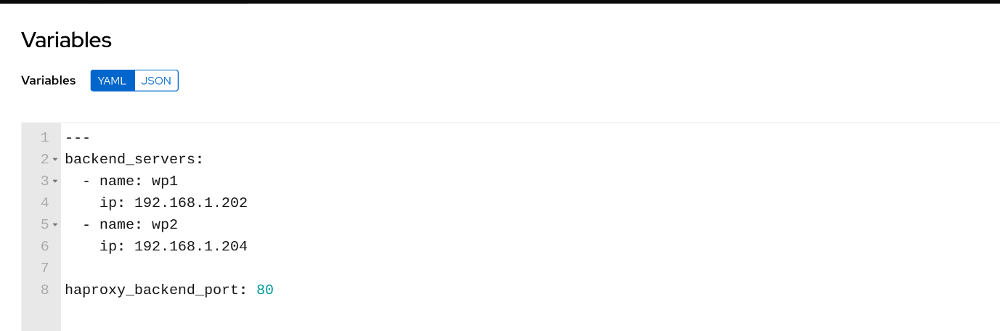

## Playbook de Ansible de HAProxy para balanceo de carga entre WordPress

Este playbook de Ansible automatiza la instalación y configuración de un balanceador de carga HAProxy en Ubuntu Server 24.04, que reparte la carga entre dos servidores WordPress previamente instalados con el playbook de wordpress.

### Requisitos

Necesitaremos una máquina Ubuntu Server con las siguientes características:

- Ubuntu Server 24.04.
- Instalado el paquete de python3.
- Instalado y configurado el servidor de ssh para la autenticación por claves.
- Maquina definida como haproxy en el inventario dentro del grupo haproxy_servers.
- IP fija establecida previamente.

### Estructura de directorios



### Playbook principal

Este playbook invoca el rol haproxy y define a los hosts del grupo haproxy_servers.

**playbook.yml**

```yaml
---
- name: Desplegar HAProxy como balanceador de carga
  hosts: haproxy_servers
  become: yes

  roles:
    - haproxy
```

### Inventario HAProxy

Este es el inventario Asoka creado en AWX, formado por el servidor asoka.



A continuación, se ha creado un grupo haproxy_servers dentro del inventario, que incluye al servidor asoka.


Al grupo se le han asignado las siguientes variables:



### Rol haproxy

Este rol instala y configura HAProxy para balancear la carga entre los dos servidores WordPress.

**tasks/main.yml**

```yaml
---
- name: Instalar paquetes necesarios
  ansible.builtin.apt:
    name:
      - haproxy
    state: present
    update_cache: yes
  become: yes

- name: Configurar archivo haproxy.cfg
  ansible.builtin.template:
    src: haproxy.cfg.j2
    dest: /etc/haproxy/haproxy.cfg
    owner: root
    group: root
    mode: '0644'
  become: yes
  notify:
    - Reiniciar HAProxy
```

**handlers/main.yml**

Handlers para reiniciar el servicio HAProxy.

```yaml
---
- name: Reiniciar HAProxy
  ansible.builtin.systemd:
    name: haproxy
    state: restarted
    enabled: yes
```

**templates/haproxy.cfg.j2**

Plantilla para la configuración de HAProxy:

```yaml
global
    log /dev/log    local0
    log /dev/log    local1 notice
    daemon

defaults
    log     global
    mode    http
    option  httplog
    option  dontlognull
    timeout connect 5000
    timeout client  50000
    timeout server  50000
    retries 3

frontend http_in
    bind *:80
    default_backend wordpress_back

backend wordpress_back
    balance roundrobin

    server {{ server.name }} {{ server.ip }}:{{ haproxy_backend_port }} check

```
