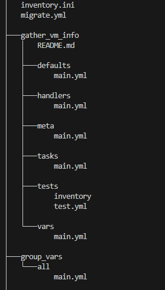
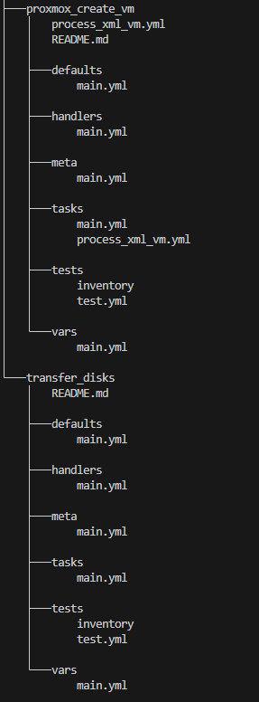
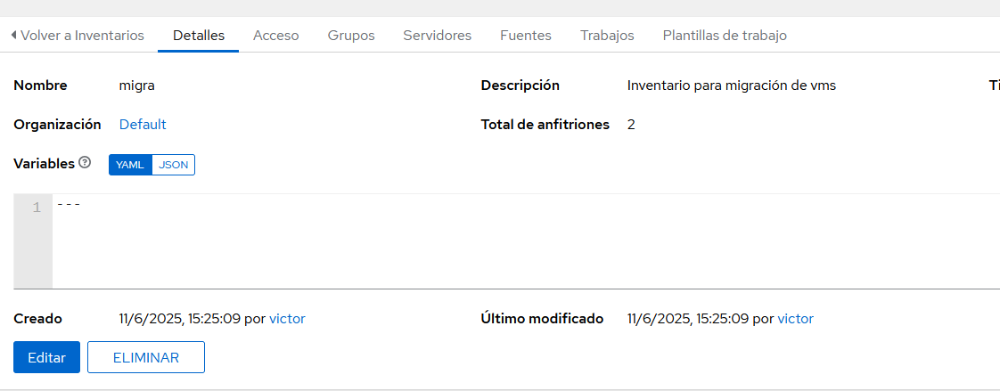
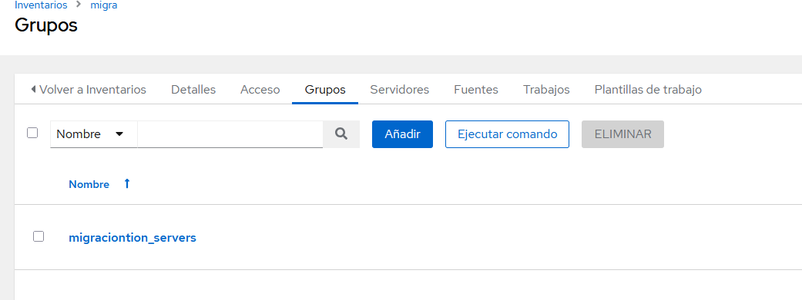
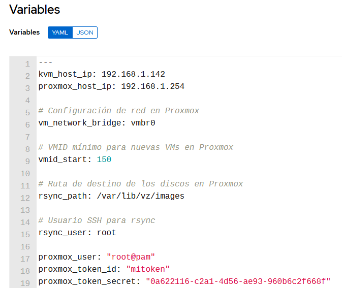

## Playbook de Ansible de Kea, Bind, Radvd y iptables:

Con este playbook se acomete una migración de máquinas virtuales entre un host linux con máquinas virtuales bajo kvm y libvirt y un host con proxmox linux.

### Requisitos

Necesitaremos una máquina debian con las siguientes carácterísticas:
- Instalados kvm, qemu, libvirt y una o más máquinas virtuales funcionales. En este caso usaremos una máquina debian y una ubuntu server, por cuestiones de optimización de recursos.
- Instalado el paquete de python
- Instalado y configurado el servidor de ssh para la autentificación por claves.

### Estructura de directorios.




Los roles usados serán:

- **gather_vm_info**: Recopila información esencial de las máquinas a migrar, volcándola a un xml, como discos y configuraciones dispositivos, cpu, etc, para facilitar el proceso de migración.
  
- **transfer_disks**: Copia los discos virtuales y los ficheros xml de cada máquina desde el host kvm hacia el host  proxmox, utilizando una carpeta asignada al id que va a tener la máquina virtual.
  
- **proxmox_create_vm**: Extrae la información necesaria para crear la máquina del fichero xml, la crea respetando el hardware, importa los discos copiados y los enlaza con su máquina virtual.


### Playbook principal

Establece unas variables globales e invoca los roles a ejecutar:

**playbook.yml**
```yaml
---
- name: Fase 1 - Recolectar información de VMs
  tags: gather
  hosts: kvm_host
  become: true
  roles:
    - gather_vm_info

- name: Fase 2 - Transferir discos
  tags: transfer
  hosts: kvm_host
  become: true
  roles:
    - transfer_disks

- name: Fase 3 - Crear VMs
  tags: create
  hosts: proxmox_host
  become: true
  roles:
    - proxmox_create_vm
```

### Inventario Migración

Este es el inventario `migra` creado en AWX, formado por el host `kvm_host` y el host `proxmox_host`.



A continuación, se ha creado un grupo migration_servers dentro del inventario, que incluye al servidor ambos.



Al grupo se le han asignado las siguientes variables:




### Rol gather_vm_info

En este rol obtenemos una lista de máquinas virtuales y, con `xmldump` volcamos su infomación a un fichero xml en `/tmp`:

**taks/main.yml**

```yaml
---
- name: Obtener lista de VMs
  command: virsh list --all --name
  register: vm_list_raw

- name: Filtrar nombres válidos de VMs
  set_fact:
    vm_names: "{{ vm_list_raw.stdout_lines | reject('equalto', '') | list }}"

- name: Obtener configuración XML de cada VM
  shell: virsh dumpxml {{ item }}
  register: vm_xmls
  loop: "{{ vm_names }}"
  loop_control:
    label: "{{ item }}"
  changed_when: false

- name: Guardar XMLs en archivos temporales
  copy:
    content: "{{ item.stdout }}"
    dest: "/tmp/{{ item.item }}.xml"
  loop: "{{ vm_xmls.results }}"
  loop_control:
    label: "{{ item.item }}"
```

### Rol transfer_disks

En este rol se obtienen las rutas de los discos del fichero xml, se obtiene una lista de los `id` de las máquinas del host proxmox para averiguar cuales están libres, se empiezan a generar `id` a partir de las un número establecido(en este caso 150) y se genera una ruta en el mismo con esta información para transferir posteriormente tanto los discos, como los xml con la información.

**tasks/main.yml**

```yaml
- name: Obtener rutas de disco desde los XMLs usando grep
  shell: >
    grep -oE "<source file='[^']+'" /tmp/{{ item }}.xml | cut -d"'" -f2
  register: vm_disk_paths
  loop: "{{ vm_names }}"
  loop_control:
    label: "{{ item }}"
  changed_when: false

- name: Crear estructura de datos con rutas de discos por VM
  set_fact:
    vms_disks: "{{ vms_disks | default({}) | combine({ item.item: item.stdout_lines }) }}"
  loop: "{{ vm_disk_paths.results }}"
  loop_control:
    label: "{{ item.item }}"

- name: Obtener lista de VMID existentes en Proxmox
  shell: "ls /etc/pve/qemu-server | grep -oE '^[0-9]+'"
  register: existing_vmids_raw
  delegate_to: "{{ proxmox_host_ip }}"
  changed_when: false

- name: Convertir lista de VMIDs existentes a enteros
  set_fact:
    existing_vmids: "{{ existing_vmids_raw.stdout_lines | map('int') | list }}"

- name: Generar lista de vmid disponibles desde 150
  set_fact:
    available_vmids: >-
      {{
        range(150, 300)
        | reject('in', existing_vmids)
        | list
      }}

- name: Asignar vmids a las VMs
  set_fact:
    vm_ids: "{{ dict(vm_names | zip(available_vmids[:(vm_names | length)])) }}"

- name: Rsync de discos al host Proxmox por VM
  synchronize:
    src: "{{ item.1 }}"
    dest: "{{ rsync_user }}@{{ proxmox_host_ip }}:{{ rsync_path }}/{{ vm_ids[item.0.key] }}/"
    mode: push
    rsync_opts:
      - "--progress"
      - "--partial"
  loop: "{{ vms_disks | dict2items | subelements('value') }}"
  loop_control:
    label: "{{ item.0.key }} -> {{ item.1 }}"
  delegate_to: "{{ kvm_host_ip }}"

- name: Rsync de XMLs al host Proxmox por VM
  synchronize:
    src: "/tmp/{{ item.key }}.xml"
    dest: "{{ rsync_user }}@{{ proxmox_host_ip }}:{{ rsync_path }}/{{ vm_ids[item.key] }}/"
    mode: push
    rsync_opts:
      - "--progress"
      - "--partial"
  loop: "{{ vm_ids | dict2items }}"
  loop_control:
    label: "{{ item.key }} -> XML"
  delegate_to: "{{ kvm_host_ip }}"
```

### Rol proxmox_create_vm

Este rol está compuesto por dos ficheros: 
- `main.yml`, que busca los xml, llama a `process_xml_vm.yml` e itera sobre cada fichero.
- `process_xml_vm.yml`, que parsea el xml y luego crea una máquina virtual con los datos obtenidos: vcpus, memoria, discos, etc. utilizando la api de proxmox. Después importa los discos al volumen de almacenamiento indicado de proxmox y los vincula con su máquina virtual.

**tasks/main.yml**

```yml
---
- name: Buscar XMLs en subdirectorios de imágenes
  find:
    paths: "{{ rsync_path }}"
    patterns: "*.xml"
    recurse: yes
  register: found_xmls

- name: Filtrar XMLs válidos
  set_fact:
    filtered_xmls: "{{ found_xmls.files }}"

- name: Incluir tareas para crear cada VM desde su XML
  include_tasks: process_xml_vm.yml
  loop: "{{ filtered_xmls }}"
  loop_control:
    loop_var: xml_file
  vars:
    xml_file: "{{ xml_file.path }}"
```

**tasks/process_xml_vm.yml**

```yaml
---
- name: Cargar XML como string
  slurp:
    src: "{{ xml_file.path }}"
  register: vm_xml

- name: Convertir XML a texto
  set_fact:
    xml_content: "{{ vm_xml.content | b64decode }}"

# --- Validar y extraer RAM ---
- name: Extraer memoria de la VM
  set_fact:
    vm_ram_matches: "{{ xml_content | regex_findall('<memory[^>]*?>(.*?)</memory>') }}"

- name: Verificar que la etiqueta <memory> existe
  fail:
    msg: "El archivo XML {{ xml_file.path }} no contiene la etiqueta <memory>."
  when: vm_ram_matches | length == 0

- name: Definir memoria en MB
  set_fact:
    vm_ram: "{{ (vm_ram_matches[0] | trim | int) // 1024 }}"

# --- Validar y extraer nombre de la VM ---
- name: Extraer nombre de la VM
  set_fact:
    vm_name_matches: "{{ xml_content | regex_findall('<name.*?>(.*?)</name>') }}"

- name: Verificar que la etiqueta <name> existe
  fail:
    msg: "El archivo XML {{ xml_file.path }} no contiene la etiqueta <name>."
  when: vm_name_matches | length == 0

- name: Definir nombre de la VM
  set_fact:
    vm_name: "{{ vm_name_matches[0] | trim }}"

# --- Validar y extraer cores ---
- name: Extraer cores de la VM
  set_fact:
    vm_cores_matches: "{{ xml_content | regex_findall('<vcpu[^>]*?>(.*?)</vcpu>') }}"

- name: Verificar que la etiqueta <vcpu> existe
  fail:
    msg: "El archivo XML {{ xml_file.path }} no contiene la etiqueta <vcpu>."
  when: vm_cores_matches | length == 0

- name: Definir número de cores
  set_fact:
    vm_cores: "{{ vm_cores_matches[0] | trim | int }}"

# --- Detectar si hay interfaz de red ---
- name: Detectar interfaz de red
  set_fact:
    vm_has_network: "{{ xml_content is search('<interface type=.network.') }}"

# --- Localizar el disco qcow2 ---
- name: Buscar disco asociado a la VM
  find:
    paths: "{{ xml_file.path | dirname }}"
    patterns: "*.qcow2"
    recurse: no
  register: found_disks

- name: Verificar que el disco existe
  fail:
    msg: "No se encontró un archivo de disco .qcow2 en {{ xml_file.path | dirname }} para la VM {{ vm_name }}."
  when: found_disks.files | length == 0

- name: Seleccionar el disco principal
  set_fact:
    disk_file: "{{ found_disks.files[0].path }}"

# --- Crear la VM base ---
- name: Crear VM base en Proxmox
  community.general.proxmox_kvm:
    api_user: "{{ proxmox_user }}"
    api_token_id: "{{ proxmox_token_id }}"
    api_token_secret: "{{ proxmox_token_secret }}"
    api_host: "{{ proxmox_host }}"
    node: "pxmx"  
    vmid: "{{ xml_file.path.split('/')[-2] }}"
    name: "{{ vm_name }}"
    memory: "{{ vm_ram }}"
    cores: "{{ vm_cores }}"
    ostype: l26
    scsihw: virtio-scsi-pci
    net: "{{ {'net0': 'virtio,bridge=vmbr0'} if vm_has_network else {} }}"
    state: present
  delegate_to: localhost
  become: false

# --- Importar el disco qcow2 ---
- name: Importar disco QCOW2 a la VM
  ansible.builtin.command: >
    qm importdisk {{ xml_file.path.split('/')[-2] }}
    {{ disk_file }}
    local-lvm
  delegate_to: 192.168.1.254

# --- Adjuntar el disco importado ---
- name: Adjuntar disco al hardware de la VM
  ansible.builtin.command: >
    qm set {{ xml_file.path.split('/')[-2] }} --scsi0 local-lvm:vm-{{ xml_file.path.split('/')[-2] }}-disk-0
  delegate_to: 192.168.1.254

# --- Configurar el disco como bootdisk ---
- name: Configurar disco de arranque
  ansible.builtin.command: >
    qm set {{ xml_file.path.split('/')[-2] }} --boot order=scsi0
  delegate_to: 192.168.1.254
```