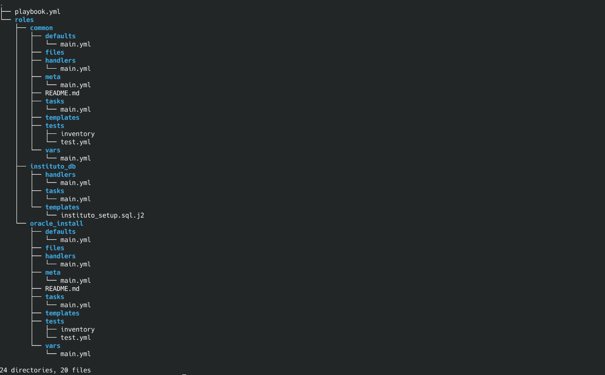
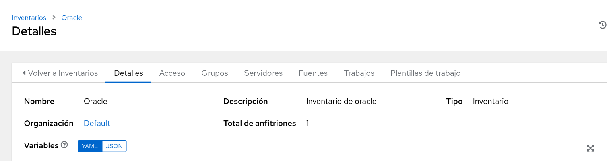
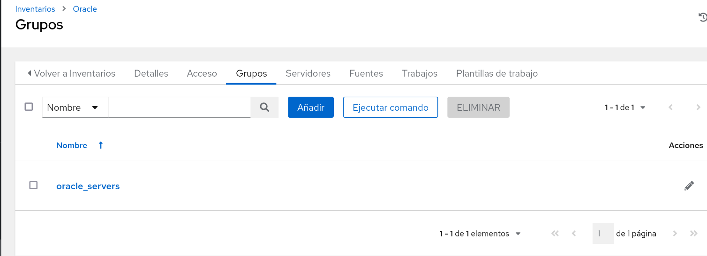
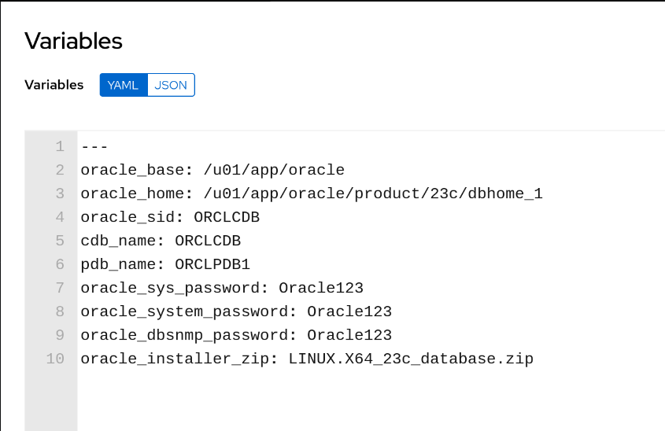

## Playbook de Ansible de Oracle Database 23ai + PDB Instituto:

Este playbook de Ansible automatiza la instalación de Oracle Database 23ai en Oracle Linux 9.5, con una PDB llamada instituto, con una base de datos funcional y personalizada, y con su listener configurado para aceptar conexiones.

### Requisitos

Necesitaremos una máquina debian con las siguientes carácterísticas:
- Máquina Oracle Linux 9.5
- El paquete oracle-database-free-23ai-1.0-1.el9.x86_64.rpm en /tmp.
- Instalado el paquete de python3.
- Instalado y configurado el servidor de ssh para la autentificación por claves.

### Estructura de directorios.



Los roles usados serán:

- common: Instala los paquetes necesarios para la instalación y establece limites de tamaño de fichero a Oracle.
- oracle_install: Instala y configura Oracle Database 23ai.
- instituto_db: Despliega el listener, la PDB Instituto y todo lo que tiene que ver con ella.

### Playbook principal

Este playbook invoca los roles que van a formar parte del playbook:

**playbook.yml**
```yaml
---
- name: Desplegar Oracle Database 23c AI con base de datos personalizada
  hosts: oracle_servers
  become: yes

  roles:
    - common
    - oracle_install
    - instituto_db
```

### Inventario Oracle

Este es el inventario Oracle creado en AWX, formado por el servidor yoda.



A continuación, se ha creado un grupo oracle_servers dentro del inventario, que incluye al servidor yoda.



Al grupo se le han asignado las siguientes variables:



### Rol common

En este rol se instalan paquetes necesarios como el preinstall-23ai y el unzip que nos hará falta para después, y se limitan los recursos del sistema al usuario oracle.

**taks/main.yml**

```yaml
---
- name: Instalar paquetes necesarios para Oracle 23c AI
  ansible.builtin.yum:
    name:
      - oracle-database-preinstall-23ai
      - unzip
    state: present

- name: Configurar límites para Oracle
  ansible.builtin.lineinfile:
    path: /etc/security/limits.conf
    line: "{{ item }}"
  loop:
    - "oracle soft nofile 1024"
    - "oracle hard nofile 65536"
    - "oracle soft nproc 16384"
    - "oracle hard nproc 16384"
```

### Rol oracle-install

En este rol se instala el .rpm de oracle-database-23ai y posteriormente se configura con expect (El comando para ejecutar el script te pide una contraseña y no tiene opciones, por lo tanto es la única forma de que Ansible no se quede stuck), finalmente se añaden las variables de entorno al .bash_profile del usuario oracle.

**tasks/main.yml**

```yaml
---
- name: Instalar el RPM de Oracle Database 23ai desde /tmp
  ansible.builtin.yum:
    name: /tmp/oracle-database-free-23ai-1.0-1.el9.x86_64.rpm
    state: present
  become: yes

- name: Instalar expect
  ansible.builtin.yum:
    name: expect
    state: present
  become: yes

- name: Copiar script expect para configurar Oracle
  ansible.builtin.copy:
    dest: /tmp/oracle_configure.expect
    mode: '0755'
    content: |
      #!/usr/bin/expect -f
      set timeout -1
      spawn /etc/init.d/oracle-free-23ai configure
      expect "Specify a password*" { send "Oracle123\r" }
      expect "Confirm the password*" { send "Oracle123\r" }
      expect eof
  become: yes

- name: Ejecutar script expect para configurar Oracle Database Free
  ansible.builtin.command: /usr/bin/expect /tmp/oracle_configure.expect
  become: yes
  register: configure_output
  failed_when: >
    configure_output.rc != 0 and
    'already configured' not in configure_output.stdout

- name: Configurar entorno Oracle en .bash_profile de oracle
  ansible.builtin.blockinfile:
    path: /home/oracle/.bash_profile
    block: |
      export ORACLE_HOME=/opt/oracle/product/23ai/dbhomeFree
      export PATH=$ORACLE_HOME/bin:$PATH
      export ORACLE_SID=FREE
      export NLS_LANG=AMERICAN_AMERICA.AL32UTF8
```

### Rol instituto_db

En este rol se configura el firewall para permitir conexiones, se añade al listener a la PDB instituto, tambien se añade instituto al tnsnames.ora, se crea la PDB instituto y se le añaden una serie de tablas y registros, y se configura el usuario admin de dicha PDB, instituto_admin.

**tasks/main.yml**

```yml
- name: Abrir el puerto 1521 en el firewall permanentemente
  ansible.builtin.firewalld:
    port: 1521/tcp
    permanent: true
    state: enabled
  notify: Reload firewall

- name: Cambiar HOST=localhost a HOST=0.0.0.0 en listener.ora
  ansible.builtin.replace:
    path: /opt/oracle/product/23ai/dbhomeFree/network/admin/listener.ora
    regexp: 'HOST\s*=\s*localhost'
    replace: 'HOST = 0.0.0.0'
  become: yes
  notify: Restart listener

- name: Añadir entrada INSTITUTO en tnsnames.ora
  ansible.builtin.blockinfile:
    path: /opt/oracle/product/23ai/dbhomeFree/network/admin/tnsnames.ora
    block: |
      INSTITUTO =
        (DESCRIPTION =
          (ADDRESS = (PROTOCOL = TCP)(HOST = 192.168.1.201)(PORT = 1521))
          (CONNECT_DATA =
            (SERVER = DEDICATED)
            (SERVICE_NAME = instituto)
          )
        )
    owner: oracle
    group: oinstall
    mode: '0644'

- name: Crear la PDB INSTITUTO en la CDB FREE
  ansible.builtin.shell: |
    export ORACLE_HOME=/opt/oracle/product/23ai/dbhomeFree
    export PATH=$ORACLE_HOME/bin:$PATH
    export ORACLE_SID=FREE
    echo "
    ALTER SESSION SET CONTAINER=CDB$ROOT;
    ALTER SYSTEM SET db_create_file_dest = '/opt/oracle/oradata/FREE' SCOPE=BOTH;
    CREATE PLUGGABLE DATABASE INSTITUTO
      ADMIN USER instituto_admin IDENTIFIED BY Oracle123;
    ALTER PLUGGABLE DATABASE INSTITUTO OPEN;
    " | $ORACLE_HOME/bin/sqlplus -s / as sysdba
  become_user: oracle

- name: Copiar script SQL para crear tablas y registros
  ansible.builtin.template:
    src: instituto_setup.sql.j2
    dest: /tmp/instituto_setup.sql
    owner: oracle
    group: oinstall
    mode: '0644'

- name: Otorgar privilegios y cuota a instituto_admin para crear tablas
  ansible.builtin.shell: |
    export ORACLE_HOME=/opt/oracle/product/23ai/dbhomeFree
    export PATH=$ORACLE_HOME/bin:$PATH
    export ORACLE_SID=FREE
    echo "
    ALTER SESSION SET CONTAINER=INSTITUTO;
    GRANT CONNECT, RESOURCE TO instituto_admin;
    ALTER USER instituto_admin QUOTA UNLIMITED ON SYSTEM;
    " | $ORACLE_HOME/bin/sqlplus -s / as sysdba
  become_user: oracle

- name: Ejecutar script SQL como instituto_admin para crear tablas y registros
  ansible.builtin.shell: |
    export ORACLE_HOME=/opt/oracle/product/23ai/dbhomeFree
    export PATH=$ORACLE_HOME/bin:$PATH
    export ORACLE_SID=FREE
    $ORACLE_HOME/bin/sqlplus -s instituto_admin/Oracle123@//localhost:1521/instituto @/tmp/instituto_setup.sql
  become_user: oracle
```


**handlers/main.yml**

Handlers para reiniciar listener y firewall.

```yaml
---
- name: Reload firewall
  ansible.builtin.systemd:
    name: firewalld
    state: reloaded

- name: Restart listener
  ansible.builtin.shell: |
    export ORACLE_HOME=/opt/oracle/product/23ai/dbhomeFree
    export PATH=$ORACLE_HOME/bin:$PATH
    export ORACLE_SID=FREE
    $ORACLE_HOME/bin/lsnrctl stop
    $ORACLE_HOME/bin/lsnrctl start
  become_user: oracle
```

Y este es el .sql que se emplea para la creación de las tablas y los registros.

**templates/instituto_setup.sql.j2**

```yml
ALTER SESSION SET CONTAINER=INSTITUTO;
WHENEVER SQLERROR EXIT SQL.SQLCODE;

-- Tabla de profesor
CREATE TABLE profesor (
  id_profesor NUMBER GENERATED BY DEFAULT AS IDENTITY PRIMARY KEY,
  nombre VARCHAR2(100 CHAR),
  especialidad VARCHAR2(100 CHAR)
);

INSERT INTO profesor (id_profesor, nombre, especialidad) VALUES (1, 'Alejandro Roca Alhama', 'Sistemas');
INSERT INTO profesor (id_profesor, nombre, especialidad) VALUES (2, 'Jose Antonio Jamonino', 'Aplicaciones Web');
INSERT INTO profesor (id_profesor, nombre, especialidad) VALUES (3, 'Antonio Pelegrin', 'Servicios en Red');
INSERT INTO profesor (id_profesor, nombre, especialidad) VALUES (4, 'Cayetano Reinaldos Duarte', 'Base de datos');
INSERT INTO profesor (id_profesor, nombre, especialidad) VALUES (5, 'Samuel Rabadan', 'Seguridad Informatica');

-- Tabla de alumno
CREATE TABLE alumno (
  id_alumno NUMBER GENERATED BY DEFAULT AS IDENTITY PRIMARY KEY,
  nombre VARCHAR2(100 CHAR),
  curso VARCHAR2(50 CHAR)
);

INSERT INTO alumno (id_alumno, nombre, curso) VALUES (1, 'Juan Carrasco Milla', '2 ASIR');
INSERT INTO alumno (id_alumno, nombre, curso) VALUES (2, 'Victor Manuel Andreu Felipe', '2 ASIR');
INSERT INTO alumno (id_alumno, nombre, curso) VALUES (3, 'Alejandro Burruezo Burru', '2 ASIR');
INSERT INTO alumno (id_alumno, nombre, curso) VALUES (4, 'Jose Corominas Pepe', '2 ASIR');
INSERT INTO alumno (id_alumno, nombre, curso) VALUES (5, 'Pablo Guerrero Bernal', '2 ASIR');
INSERT INTO alumno (id_alumno, nombre, curso) VALUES (6, 'Moises Lacabra GOAT', '2 ASIR');

-- Tabla de curso
CREATE TABLE curso (
  id_curso NUMBER GENERATED BY DEFAULT AS IDENTITY PRIMARY KEY,
  nombre VARCHAR2(50 CHAR)
);

INSERT INTO curso (id_curso, nombre) VALUES (1, '2 ASIR');

-- Tabla de asignatura
CREATE TABLE asignatura (
  id_asignatura NUMBER GENERATED BY DEFAULT AS IDENTITY PRIMARY KEY,
  nombre VARCHAR2(100 CHAR),
  profesor_id NUMBER,
  CONSTRAINT fk_profesor FOREIGN KEY (profesor_id) REFERENCES profesor(id_profesor)
);

-- Insertamos las asignatura con IDs explícitos
INSERT INTO asignatura (id_asignatura, nombre, profesor_id) VALUES (1, 'Bases de datos', 4);
INSERT INTO asignatura (id_asignatura, nombre, profesor_id) VALUES (2, 'Sistemas', 1);
INSERT INTO asignatura (id_asignatura, nombre, profesor_id) VALUES (3, 'Aplicaciones Web', 2);
INSERT INTO asignatura (id_asignatura, nombre, profesor_id) VALUES (4, 'Seguridad Informatica', 5);

-- Tabla de matricula
CREATE TABLE matricula (
  id_matricula NUMBER GENERATED BY DEFAULT AS IDENTITY PRIMARY KEY,
  alumno_id NUMBER,
  asignatura_id NUMBER,
  nota NUMBER(3,1),
  CONSTRAINT fk_alumno FOREIGN KEY (alumno_id) REFERENCES alumno(id_alumno),
  CONSTRAINT fk_asignatura FOREIGN KEY (asignatura_id) REFERENCES asignatura(id_asignatura)
);

-- Insertamos matricula (ya funcionan porque los IDs existen)
INSERT INTO matricula (alumno_id, asignatura_id, nota) VALUES (1, 1, 8.5);
INSERT INTO matricula (alumno_id, asignatura_id, nota) VALUES (2, 2, 7.0);
INSERT INTO matricula (alumno_id, asignatura_id, nota) VALUES (3, 3, 9.0);
INSERT INTO matricula (alumno_id, asignatura_id, nota) VALUES (4, 1, 6.5);
INSERT INTO matricula (alumno_id, asignatura_id, nota) VALUES (5, 4, 7.5);
INSERT INTO matricula (alumno_id, asignatura_id, nota) VALUES (6, 2, 8.0);

COMMIT;
EXIT;
```