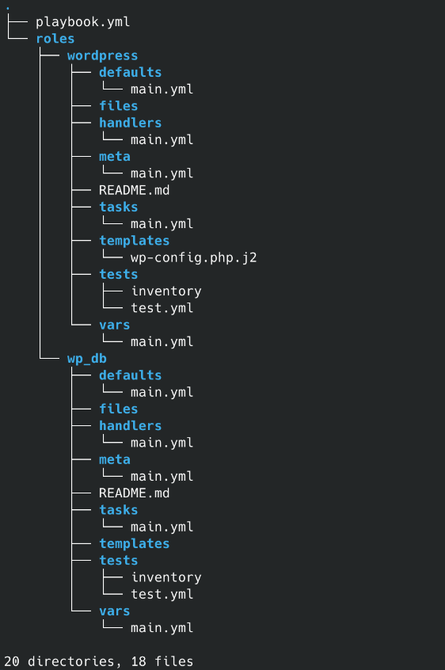
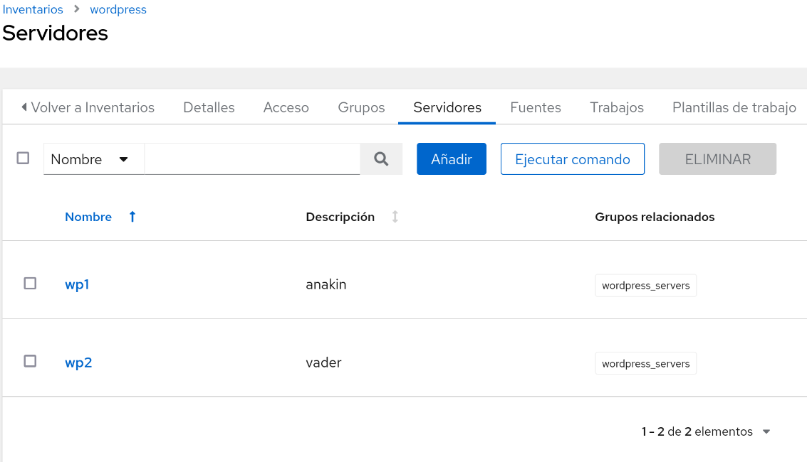
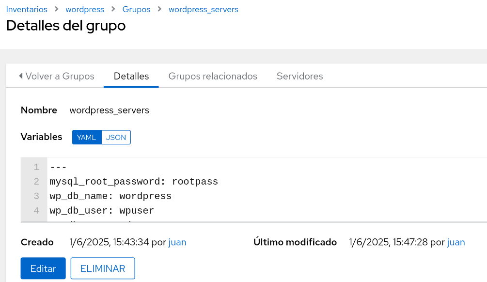
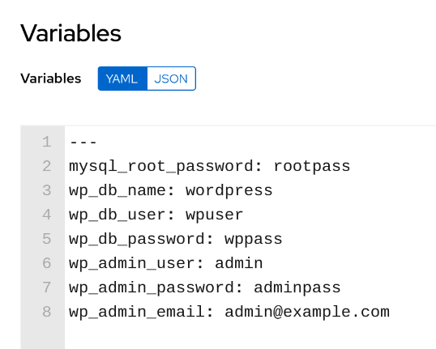

## Playbook de Ansible de Oracle Database 23ai + PDB Instituto:

Este playbook de Ansible automatiza la instalación y configuración de dos Wordpress en Ubuntu Server 24.04 cada uno con un titulo de página diferente: AnsibleRocks1 y AnsibleRocks2, y su base de datos configurada y lista para usar.

### Requisitos

Necesitaremos dos máquinas Ubuntu Server con las siguientes carácterísticas:
- Ubuntu Server 24.04
- Instalado el paquete de python3.
- Instalado y configurado el servidor de ssh para la autentificación por claves.
- Cada máquina bien definida como wp1 o wp 2 dentro de un grupo wordpress_servers.
- IP fija establecida previamente.

### Estructura de directorios.



### Playbook principal

Este playbook invoca el unico rol que forma parte el playbook y especifica a los hosts del grupo wordpress_servers.

**playbook.yml**
```yaml
---
- name: Desplegar WordPress en dos máquinas con páginas personalizadas
  hosts: wordpress_servers
  become: yes

  roles:
    - common_db
    - wordpress
```

### Inventario wordpress

Este es el inventario wordpress creado en AWX, está formado por los servidores wp1 y wp2, que son anakin y vader.


A continuación se ha creado un grupo wordpress_servers dentro del inventario, que engloba a ambos servidores.



Y finalmente al grupo se le han asignado estas variables:



### Rol wp_db

En este rol se descargan los paquetes necesarios y se configuran todos los parametros de base de datos requerios para la instalación de Wordpress.

**taks/wp_db.yml**

```yaml
---
- name: Instalar paquetes necesarios
  ansible.builtin.apt:
    name:
      - apache2
      - php
      - php-mysql
      - mariadb-server
      - wget
      - unzip
      - python3-pymysql
      - python3-pip
      - python3-requests
      - python3-urllib3
    state: present
    update_cache: yes
  become: yes

- name: Iniciar y habilitar servicios
  ansible.builtin.service:
    name: "{{ item }}"
    state: started
    enabled: yes
  loop:
    - apache2
    - mariadb
  become: yes

- name: Asegurar que root puede autenticarse con contraseña en MariaDB
  ansible.builtin.shell: |
    mysql -u root <<EOF
    ALTER USER 'root'@'localhost' IDENTIFIED BY '{{ mysql_root_password }}';
    FLUSH PRIVILEGES;
    EOF
  args:
    executable: /bin/bash
  become: yes

- name: Asegurar que la base de datos de WordPress existe
  community.mysql.mysql_db:
    name: "{{ wp_db_name }}"
    state: present
    login_user: root
    login_password: "{{ mysql_root_password }}"
  become: yes

- name: Crear usuario de WordPress en MySQL
  community.mysql.mysql_user:
    name: "{{ wp_db_user }}"
    password: "{{ wp_db_password }}"
    priv: "{{ wp_db_name }}.*:ALL"
    host: "localhost"
    state: present
    login_user: root
    login_password: "{{ mysql_root_password }}"
  become: yes
```

### Rol wordpress

En este rol se descarga y descomprime wordpress, le pegamos nuestro template del wp-config y con wp-cli terminamos la otra parte de la instalación. Tambien le asignamos el documentroot y le especificamos a cada host su titulo personalizado.

**tasks/main.yml**

```yaml
---
- name: Descargar WordPress manualmente usando wget
  ansible.builtin.shell: wget -O /tmp/wordpress.tar.gz https://wordpress.org/latest.tar.gz
  args:
    creates: /tmp/wordpress.tar.gz
  become: yes

- name: Descomprimir WordPress
  ansible.builtin.unarchive:
    src: /tmp/wordpress.tar.gz
    dest: /var/www/html/
    remote_src: yes
  become: yes

- name: Copiar archivo de configuración wp-config.php
  ansible.builtin.template:
    src: wp-config.php.j2
    dest: /var/www/html/wordpress/wp-config.php
  become: yes

- name: Descargar wp-cli.phar
  command: wget https://raw.githubusercontent.com/wp-cli/builds/gh-pages/phar/wp-cli.phar -O /usr/local/bin/wp

- name: Dar permisos de ejecución a wp-cli
  file:
    path: /usr/local/bin/wp
    mode: '0755'
    owner: root
    group: root

- name: Establecer el título de la portada de WordPress según el servidor
  ansible.builtin.set_fact:
    wp_title: "{{ 'AnsibleRocks1' if inventory_hostname == 'wp1' else 'AnsibleRocks2' }}"

- name: Instalar WordPress automáticamente con wp-cli como root
  tags: wp-cli
  command: >
    wp core install
    --url="http://{{ ansible_host }}/"
    --title="{{ wp_title }}"
    --admin_user="{{ wp_admin_user }}"
    --admin_password="{{ wp_admin_password }}"
    --admin_email="{{ wp_admin_email }}"
    --path=/var/www/html/wordpress
    --allow-root
  become: yes
  args:
    chdir: /var/www/html/wordpress

- name: Ajustar permisos en /var/www/html
  ansible.builtin.file:
    path: /var/www/html
    state: directory
    recurse: yes
    owner: www-data
    group: www-data
  become: yes

- name: Establecer DocumentRoot de Apache a /var/www/html/wordpress
  ansible.builtin.lineinfile:
    path: /etc/apache2/sites-available/000-default.conf
    regexp: '^\s*DocumentRoot'
    line: '    DocumentRoot /var/www/html/wordpress'
  become: yes
  Notify: Reiniciar Apache
```

**handlers/main.yml**

Handlers para reiniciar listener y firewall.

```yaml
---
  - name: Reiniciar Apache
    ansible.builtin.systemd:
      name: apache2
      state: restarted
      enabled: yes

```

Y este es el fichero plantilla que junto con las variables de grupo que antes hemos definido establece la configuración de la base de datos que Wordpress necesita para su correcto funcionamiento.

**templates/wp-config.php.j2**

```yml
<?php
define('DB_NAME', '{{ wp_db_name }}');
define('DB_USER', '{{ wp_db_user }}');
define('DB_PASSWORD', '{{ wp_db_password }}');
define('DB_HOST', 'localhost');
define('DB_CHARSET', 'utf8');
define('DB_COLLATE', '');
$table_prefix  = 'wp_';
define('WP_DEBUG', false);
if ( !defined('ABSPATH') )
    define('ABSPATH', dirname(__FILE__) . '/');
require_once(ABSPATH . 'wp-settings.php');
?>
```