# Resumen

VirtuStack desarrolla una solución integral para la gestión y sincronización automatizada de máquinas virtuales y usuarios en un entorno de infraestructura IT, utilizando un dashboard web propio y la plataforma de automatización AWX. La aplicación, construida con tecnologías modernas como Next.js, React, Node.js y MySQL, permite a los administradores crear, monitorizar y sincronizar recursos de forma segura y eficiente, integrando autenticación, ejecución remota de comandos con asistente de IA y gestión centralizada de credenciales y usuarios.

# Contextualización del Proyecto

En entornos IT modernos, la gestión eficiente de recursos virtualizados y usuarios es fundamental para garantizar la seguridad, la escalabilidad y la operatividad de los servicios. Plataformas como AWX (la versión open-source de Ansible Tower) facilitan la automatización de tareas, pero muchas organizaciones requieren interfaces personalizadas que se adapten a sus flujos de trabajo y sistemas existentes. Este proyecto surge para cubrir esa necesidad, proporcionando una capa de integración entre AWX y una aplicación web propia que centraliza la administración de máquinas virtuales y usuarios.

# Justificación de la Elección del Tema

La automatización y la administración centralizada de infraestructuras virtuales son tendencias clave en la evolución de los sistemas IT. Sin embargo, la integración entre herramientas de automatización como AWX y aplicaciones personalizadas no siempre es trivial, especialmente cuando se requiere una gestión segura de usuarios, contraseñas y recursos virtuales. Elegir este tema permite abordar un reto real en la industria, aplicando tecnologías actuales y buenas prácticas de desarrollo seguro y escalable.

# Objetivos del Proyecto

**- Objetivo General**

Desarrollar una plataforma web que integre la gestión de máquinas virtuales y su administación mediante IA y usuarios con AWX, permitiendo la automatización y sincronización de recursos de forma segura y eficiente.

**- Objetivos Específicos**

- Implementar un dashboard web intuitivo para la creación y gestión de máquinas virtuales y usuarios.

- Integrar la aplicación con AWX mediante su API REST, automatizando la creación y asociación de usuarios y organizaciones.

- Garantizar la seguridad en el almacenamiento y transmisión de credenciales, empleando hash bcrypt para contraseñas.

- Ejecutar comandos remotos en las VMs mediante SSH y reflejar los resultados en tiempo real con la asistencia de Gemini

- Sincronizar el estado de las VMs y usuarios entre la base de datos local y AWX.

- Proporcionar un sistema robusto de manejo de errores y validación tanto en frontend como en backend.

- Aprovechar el potencial de Ansible como herramienta de automatización mediante la creación de playbooks de infraestructura y despliegue.


# Marco Teórico

**Virtualización**: Tecnología que permite ejecutar múltiples sistemas operativos en una sola máquina física, optimizando recursos y facilitando la administración.

**Proxmox**: Plataforma de virtualización de código abierto que permite la gestión centralizada de máquinas virtuales y contenedores.

**Automatización IT**: Uso de herramientas como Ansible/AWX para la orquestación y automatización de tareas de infraestructura, mejorando la eficiencia y reduciendo errores humanos.

**Ansible**: Herramienta de automatización de TI que permite configurar y desplegar infraestructuras mediante playbooks escritos en YAML, facilitando la estandarización y la escalabilidad de los despliegues.

**AWX**: Plataforma open-source que proporciona una interfaz web y API REST para gestionar y automatizar tareas con Ansible.

**Node.js y Next.js**: Entorno y framework para el desarrollo de aplicaciones web, permitiendo la integración de backend y frontend en un mismo proyecto.

**MySQL**: Sistema de gestión de bases de datos relacional, empleado para almacenar información de usuarios, máquinas virtuales y credenciales.

**SSH**: Protocolo seguro para la administración remota de sistemas, utilizado aquí para ejecutar comandos en las VMs.

**WireGuard**: Protocolo de VPN que ofrece una conexión segura y eficiente entre redes, utilizado para habilitar el acceso remoto y la comunicación cifrada entre los distintos componentes del proyecto.

# Metodología

**Análisis de requisitos**: Identificación de necesidades de gestión y sincronización entre la aplicación y AWX.

**Diseño de arquitectura**: Definición de la estructura de la base de datos, endpoints de la API y flujos de integración con AWX.

**Desarrollo incremental**: Implementación iterativa de funcionalidades, comenzando por la gestión básica de VMs y usuarios, y añadiendo integración con AWX y SSH.

**Pruebas y validación**: Verificación funcional de los endpoints, pruebas de seguridad (hash de contraseñas, manejo de errores) y validación de la integración con AWX.

**Documentación y entrega**: Elaboración de documentación técnica para la correcta instalación, uso y mantenimiento de la infraestructura.

# Infraestructura

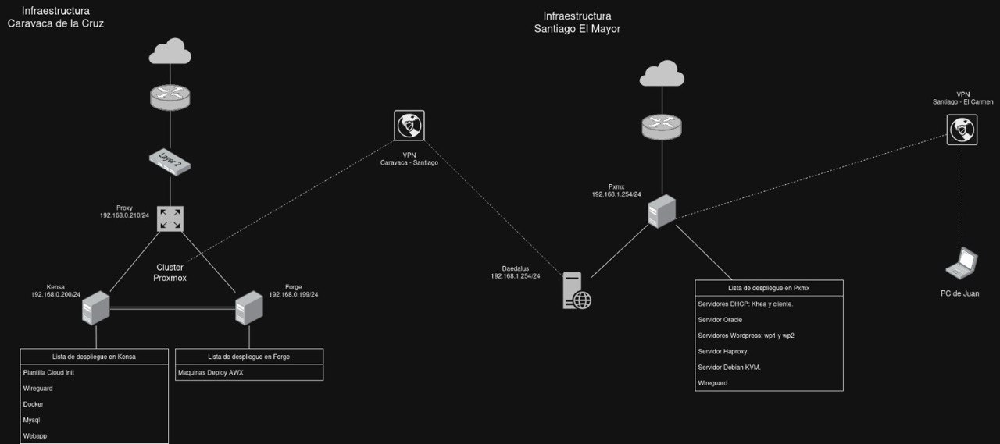

\newpage

# Proxy nginx
Configuración de proxy

```config
server {
    listen 80;
    server_name cromopolis.duckdns.org;
    return 301 https://$host$request_uri;
}
server {
    listen 443 ssl;
    server_name cromopolis.duckdns.org;

    ssl_certificate /etc/letsencrypt/live/cromopolis.duckdns.org/fullchain.pem;
    ssl_certificate_key /etc/letsencrypt/live/cromopolis.duckdns.org/privkey.pem;

    ssl_protocols TLSv1.2 TLSv1.3;
    ssl_ciphers HIGH:!aNULL:!MD5;

    # Proxy para WebSocket SSH interactivo
    location /ws/ {
        proxy_pass http://192.168.0.194:8080/;
        proxy_http_version 1.1;
        proxy_set_header Upgrade $http_upgrade;
        proxy_set_header Connection "Upgrade";
        proxy_set_header Host $host;
        proxy_read_timeout 3600;
    }
    # Proxy para tu app Next.js
    location / {
        proxy_pass http://192.168.0.194:3000;
        proxy_set_header Host $host;
        proxy_set_header X-Real-IP $remote_addr;
        proxy_set_header X-Forwarded-For $proxy_add_x_forwarded_for;
        proxy_set_header X-Forwarded-Proto $scheme;
    }
}
```

\newpage
# Certificado SSL

## 1. Requisitos previos

- *Dominio DuckDNS* activo (ejemplo: cromopolis.duckdns.org)
- *Token DuckDNS* 
- *Servidor Linux* con acceso a internet
- *Certbot* instalado 

## 2. Iniciar el proceso con Certbot

Ejecutar el siguiente comando para iniciar la solicitud del certificado:

```bash
sudo certbot certonly --manual --preferred-challenges dns -d cromopolis.duckdns.org
```

Certbot mostrará un mensaje parecido a este:

```
Please deploy a DNS TXT record under the name:

_acme-challenge.cromopolis.duckdns.org.

with the following value:

VALOR_UNICO_QUE_TE_DA_CERTBOT

```

## 3. Gestionar el registro TXT en DuckDNS

### 3.1. Borrar el registro TXT anterior (opcional pero recomendable):

curl "https://www.duckdns.org/update?domains=cromopolis&token=TU_TOKEN&clear=true"


### 3.2. Crear el nuevo registro TXT con el valor que te da Certbot:

curl "https://www.duckdns.org/update?domains=cromopolis&token=TU_TOKEN&txt=VALOR_UNICO_QUE_TE_DA_CERTBOT"


- Sustituye TU_TOKEN por tu token real de DuckDNS.
- Sustituye VALOR_UNICO_QUE_TE_DA_CERTBOT por el valor exacto que te muestra Certbot.

## 4. Verificar la propagación del registro TXT

Antes de continuar, verifica que el registro TXT esté visible en servidores DNS públicos:

dig _acme-challenge.cromopolis.duckdns.org TXT @8.8.8.8
dig _acme-challenge.cromopolis.duckdns.org TXT @1.1.1.1
dig _acme-challenge.cromopolis.duckdns.org TXT @9.9.9.9


## 5. Completar el proceso en Certbot

Cuando el registro TXT esté correctamente propagado y visible en los DNS públicos, vuelve a la terminal donde Certbot espera y pulsa *Enter*.

Si todo está correcto, Certbot mostrará un mensaje de éxito y los archivos generados:

- Certificado: /etc/letsencrypt/live/cromopolis.duckdns.org/fullchain.pem
- Clave privada: /etc/letsencrypt/live/cromopolis.duckdns.org/privkey.pem

# Portainer

Plataforma en la que se encuentran los contenedores docker.
Contenedor que comunica con DuckDns para el cambio de IP pública


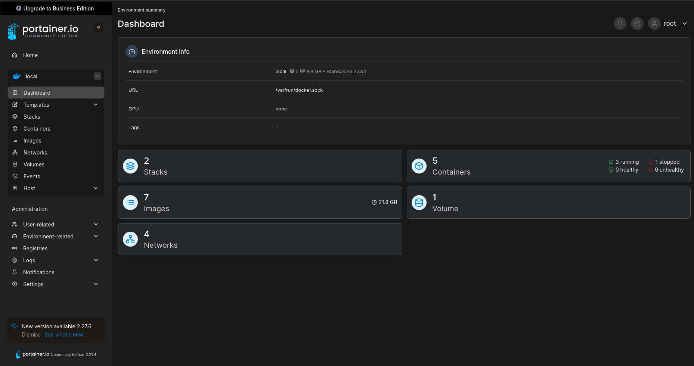
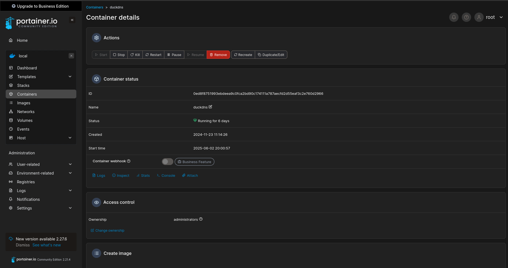

\newpage
```config
services:
  duckdns:
    image: lscr.io/linuxserver/duckdns:latest
    container_name: duckdns
    network_mode: host #optional
    environment:
      - PUID=1000 #optional
      - PGID=1000 #optional
      - TZ=Etc/UTC #optional
      - SUBDOMAINS=cromopolis
      - TOKEN=x
      - LOG_FILE=false #optional
    volumes:
      - /root/docker/duckdns/config:/config #optional
    restart: unless-stopped

```

# Wireguard

\begin{figure}[H]
  \centering
  \includegraphics[height=0.32\textheight]{fotos/wireguard.png}
  \includegraphics[height=0.32\textheight]{fotos/wireguard2.png}
  \includegraphics[height=0.32\textheight]{fotos/wireguard3.png}
\end{figure}

# DDNS

Duck DNS se utiliza como servicio de DNS dinámico (DDNS) para asociar un subdominio a la IP pública de nuestra red, lo que resulta esencial cuando no disponemos de una IP fija. En este proyecto, se emplea un contenedor de Docker que actualiza automáticamente la IP pública registrada en Duck DNS cada pocos minutos, asegurando que el subdominio apunte siempre a la dirección correcta incluso si la IP cambia. De este modo, es posible acceder de forma remota y sencilla a los servicios desplegados en la red local, sin preocuparse por los cambios de dirección IP asignados por el proveedor de Internet

# Cloud init
Cloud-init es una herramienta ampliamente utilizada para automatizar la configuración inicial de máquinas virtuales Linux en entornos de nube o virtualización. Permite personalizar una instancia durante su primer arranque (o en arranques posteriores) aplicando configuraciones como la creación de usuarios, la instalación de paquetes, la configuración de redes, la asignación de claves SSH, o la ejecución de scripts personalizados

# Gitlab
GitLab es una plataforma de gestión de código fuente y control de versiones basada en Git, ampliamente utilizada para almacenar, organizar y colaborar en proyectos de software. En este proyecto, GitLab se emplea como repositorio centralizado donde se almacena todo el código fuente del dashboard, el backend y los scripts de integración con AWX, lo que facilita el trabajo colaborativo y el seguimiento de los cambios realizados a lo largo del desarrollo

El uso de GitLab permite aprovechar el control de versiones distribuido, de modo que cada desarrollador puede trabajar con una copia local del proyecto, crear ramas para nuevas funcionalidades o correcciones, y fusionar los cambios de forma segura y transparente en la rama principal

\newpage


# Plataforma web

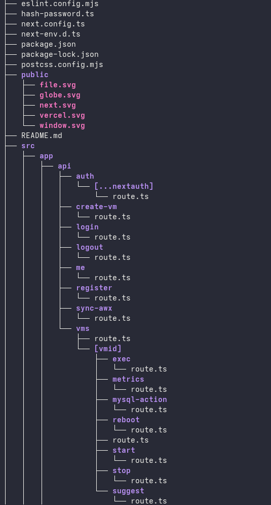{ width=45% }
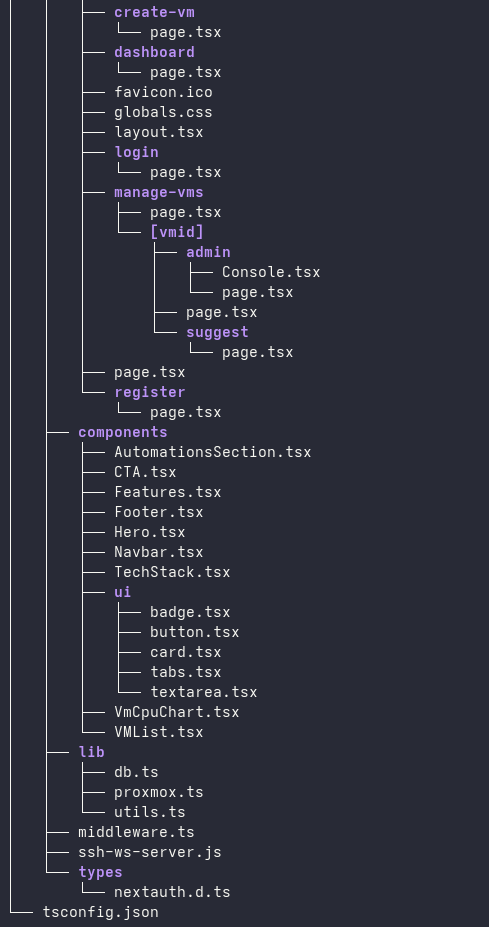{ width=45% }


Este proyecto es una plataforma web para la gestión y automatización de máquinas virtuales y usuarios, integrando servicios como AWX y Proxmox. Está desarrollado con Next.js (React) y Node.js, y utiliza una arquitectura modular con separación clara entre frontend, backend (API), componentes y utilidades.

**Frontend:**
    Las páginas de usuario, como el dashboard, login, registro y la creación y gestión de VMs, se encuentran en src/app/. Estas páginas interactúan con la API mediante formularios y peticiones HTTP.

**Backend/API:**
    La lógica de negocio y las integraciones externas residen en los endpoints de la API, ubicados en src/app/api/. Aquí se gestionan operaciones como autenticación, registro de usuarios, creación de VMs, sincronización con AWX, y acciones sobre las máquinas virtuales (iniciar, detener, reiniciar, obtener métricas, ejecutar comandos, etc.).

**Componentes reutilizables:**
    En src/components/ se encuentran los elementos de interfaz reutilizables y secciones del dashboard, como tablas de VMs, gráficos de uso de CPU, formularios y elementos UI personalizados.

**Integración y utilidades:**
    El directorio src/lib/ contiene la lógica de conexión con la base de datos (db.ts), integración con Proxmox (proxmox.ts), y funciones auxiliares (utils.ts).

**Gestión de autenticación:**
    Se utiliza NextAuth para la autenticación de usuarios, con rutas protegidas y middleware (middleware.ts) para asegurar el acceso.

**Scripts y configuración:**
    Archivos como hash-password.ts permiten operaciones específicas (por ejemplo, generar hashes bcrypt para contraseñas). Los archivos de configuración (next.config.ts, tsconfig.json, etc.) definen el entorno de desarrollo y despliegue.

Recursos estáticos:
    Imágenes y archivos públicos se almacenan en la carpeta public/.

## Resultados

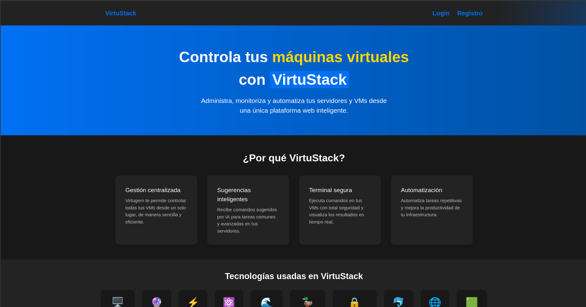
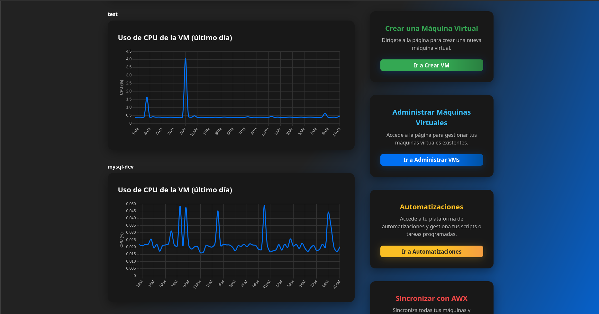
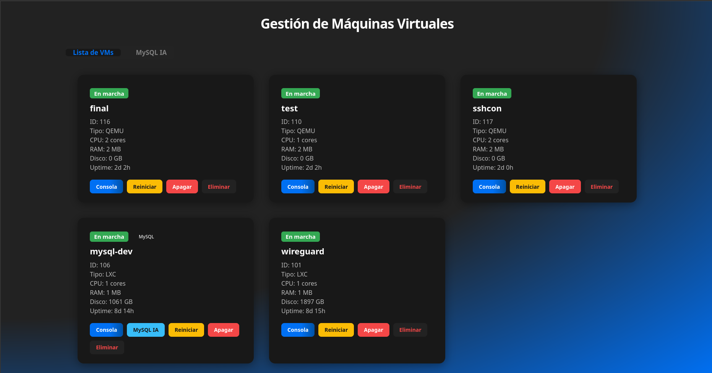


# AWX

# 1. Requisitos previos

- *Maquina debian 12* con acceso a internet

## 2. Instalación de paquetes

Antes de proceder al despliegue de AWX, es necesario preparar el entorno con herramientas esenciales, para ello instalamos los siguientes paquetes:

```bash
apt install -y curl wget vim git net-tools gnupg2 lsb-release ca-certificates apt-transport-https
```

## 3. Instalamos Kubernetes con k3s

En este caso optamos como orquestador por k3s, que es una distribución ligera y optimizada de Kubernetes.

```bash
curl -sfL https://get.k3s.io | sh -
```

Una vez instalado verificamos que funciona:

```bash
kubectl get nodes
```

## 4. Instalamos Kustomize

AWX Operator utiliza Kustomize para gestionar las configuraciones de despliegue. Para instalarlo:

```bash
curl -s "https://raw.githubusercontent.com/kubernetes-sigs/kustomize/master/hack/install_kustomize.sh" | bash
mv kustomize /usr/local/bin/
```

## 5. Instalamos AWX Operator

Para facilitar el despliegue y gestión de AWX dentro de Kubernetes, se emplea el AWX Operator. Este componente permite administrar la instancia de AWX de forma declarativa y sencilla.

**Clonamos el repositorio oficial**

```bash
git clone https://github.com/ansible/awx-operator.git
cd awx-operator
git checkout 2.14.0
```

**Creamos el namespace de Kubernetes donde se alojará AWX**

```bash
kubectl create namespace awx
```

**Desplegamos el operador**


```bash
make deploy NAMESPACE=awx
```

:::tip
El comando make deploy usa Kustomize para instalar el operador.
:::

## 6. Instalamos la instancia de AWX

Finalmente, se despliega la instancia de AWX dentro de Kubernetes mediante un fichero awx.yml que define los parámetros básicos de funcionamiento:

```yaml
apiVersion: awx.ansible.com/v1beta1
kind: AWX
metadata:
  name: awx
  namespace: awx
spec:
  service_type: nodeport
  ingress_type: none
```

Se aplica la configuración al clúster:

```bash
kubectl apply -f awx.yml
```

## 7. Resultado final:

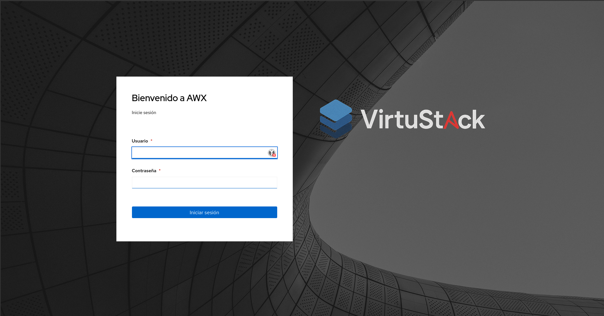

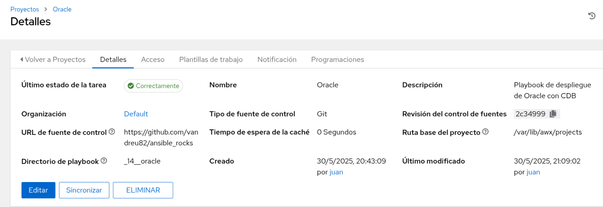

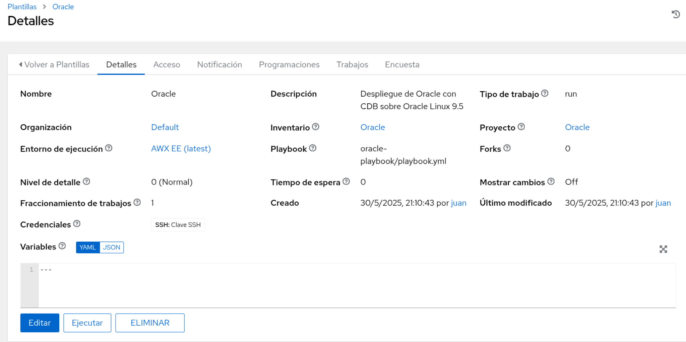

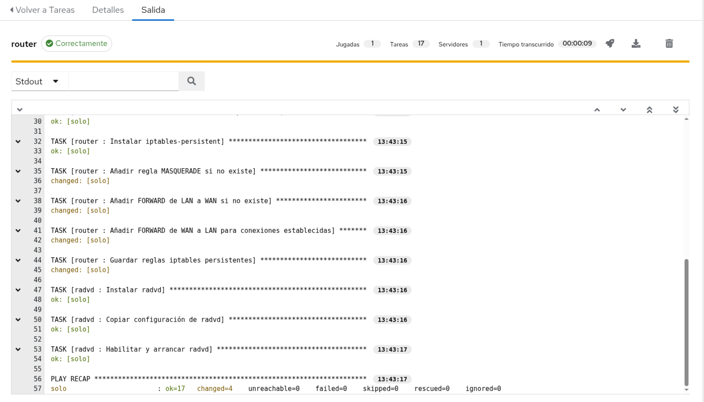

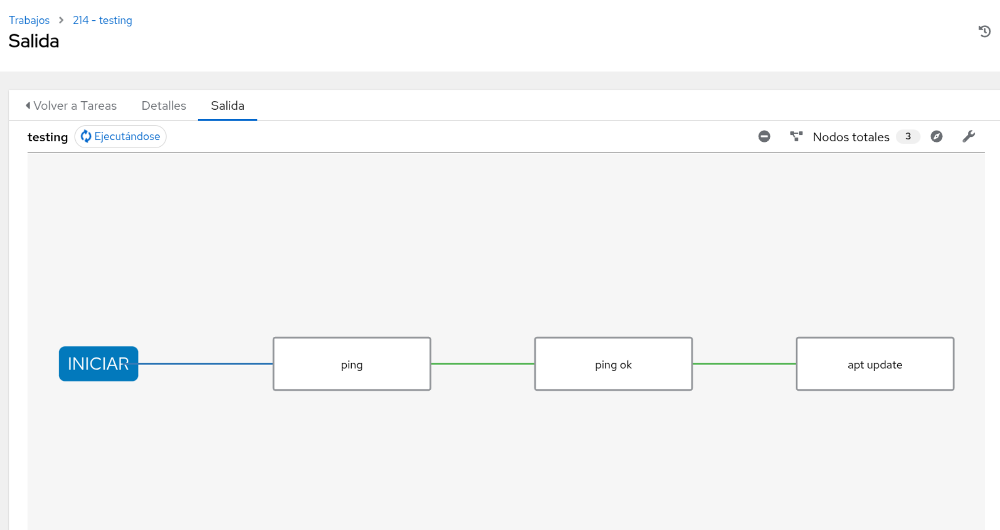

# Github

En este proyecto, GitHub se utiliza como repositorio remoto para almacenar los playbooks de Ansible, que son consumidos directamente por AWX para automatizar las tareas de despliegue y gestión de infraestructura.

Permite centralizar y versionar los playbooks de forma segura, garantizando que cualquier cambio realizado sea fácilmente auditable y recuperable. 

Además, en GitHub hemos almacenado también la documentación generada a lo largo del desarrollo, ya que nos permite trabajar de forma sincronizada y facilita la colaboración, manteniendo un único punto de referencia actualizado y accesible.

# Playbooks

## Playbook de Oracle

Este playbook automatiza el despliegue de Oracle Database 23ai sobre Oracle Linux 9.5, instalando el software necesario, configurando la base de datos, el listener para las conexiones y una PDB instituto funcional con su respectivo esquema de base de datos.

**Roles incluidos:**

* **common**: Instala paquetes y configuraciones comunes para la máquina.
* **oracle_install**: Encargado de instalar y configurar Oracle Database, incluyendo esto la descarga, la instalación y la inicialización del servicio.
* **instituto_db**: Configura las variables de entorno, el listener para servir a la PDB institutoy crea la PDB instituto junto al user instituto_admin, que será el dueño del esquema de la base de datos que también se crea con un script.sql durante el rol. 

## Playbook de WordPress

Automatiza la instalación y configuración de dos servidores WordPress en Ubuntu Server, cada uno con su propia página de inicio personalizada y base de datos preparada para uso inmediato.

**Roles incluidos:**

* **common_db**: Configura la base de datos, crea usuarios y garantiza la conectividad segura entre WordPress y MySQL.
* **wordpress**: Despliega y configura WordPress, estableciendo la instalación con templates.
* **wp_db**: Gestiona la configuración de la base de datos para cada instancia de WordPress.

## Playbook de HAProxy

Configura un servidor HAProxy para balancear la carga entre las dos instancias de WordPress, mejorando la disponibilidad y la capacidad de respuesta de la plataforma.

**Roles incluidos:**

* **haproxy**: Instala y configura el servicio HAProxy, creando las reglas de balanceo mediante un template con variables.

## Playbook de Router (Kea y BIND)

Despliega un servidor router que integra DHCP (Kea) y DNS (BIND) para gestionar de forma centralizada las direcciones IP y la resolución de nombres, con soporte tanto para IPv4 como para IPv6.

**Roles incluidos:**

* **network-setup**: Aplica las configuraciones de red necesarias en la máquina, incluyendo la interfaz de red y el direccionamiento IP.
* **kea**: Configura el servidor DHCP con soporte para redes IPv4 e IPv6, permitiendo la asignación automática de direcciones IP.
* **bind**: Configura el servidor DNS con zonas directas e inversas, asegurando la resolución de nombres en la red interna.
* **router**: Gestiona la configuración de red, incluyendo el reenvío de paquetes y el enrutamiento necesario para interconectar las distintas subredes.
* **radvd**: Implementa el servicio de anuncios de router para IPv6, permitiendo tener una puerta de enlace IPv6.

## Playbook de Migración de Máquinas Virtuales

Facilita la migración de máquinas virtuales desde un entorno local Debian/KVM a un entorno remoto Proxmox, garantizando la integridad y el funcionamiento tras el traslado.

Por supuesto. Aquí tienes una versión más técnica y precisa del mismo contenido:

---

**Roles incluidos:**

* **gather_vm_info**: Extrae información estructurada de las máquinas virtuales KVM a un fichero xml, incluyendo configuración de CPU, memoria, interfaces de red y dispositivos de almacenamiento. Esta información se almacena en formato xml para su posterior uso automatizado.

* **transfer_disks**: Detecta el primer vmid libre a partir de un umbral definido, crea el directorio correspondiente en el nodo Proxmox remoto, y transfiere los discos de las VMs, junto con los archivos de configuración xml usando rsync, asegurando la consistencia mediante sincronización diferencial.

* **proxmox_create_vm**: Automatiza la creación de máquinas virtuales en Proxmox a partir de los datos previamente recopilados. Define las VMs con los parámetros de hardware correctos, importa discos al almacenamiento LOCAL DE PROXMOX, y enlaza los discos a las máquinas.
  
# Resultados

Se ha conseguido una integración completa y funcional entre el dashboard propio y AWX, permitiendo la gestión centralizada de máquinas virtuales y usuarios.

El sistema garantiza la seguridad de las credenciales mediante el uso de hash bcrypt y la transmisión segura de datos.

La automatización de tareas administrativas y la sincronización de datos han reducido el esfuerzo manual y el riesgo de errores humanos.

El dashboard ofrece una experiencia de usuario intuitiva y robusta, con validación de datos y mensajes de error claros.

Los objetivos generales y específicos han sido alcanzados, demostrando la viabilidad y utilidad de la solución propuesta.


# Webgrafía:

- [Let's Encrypt](https://letsencrypt.org/)
- [DuckDNS](https://www.duckdns.org/)
- [Certbot](https://certbot.eff.org/)
- [Herramienta online para consultar registros TXT](https://toolbox.googleapps.com/apps/dig/)
- [Proxmox](https://www.proxmox.com/en/)
- [AWX](https://github.com/ansible/awx)

## 10. Anexos 

- https://github.com/vandreu82/ansible_rocks
- https://github.com/Juaninux/Documentacion_TFG
- https://gitlab.com/burruezo/pyapp
- https://www.youtube.com/@VirtuStack


